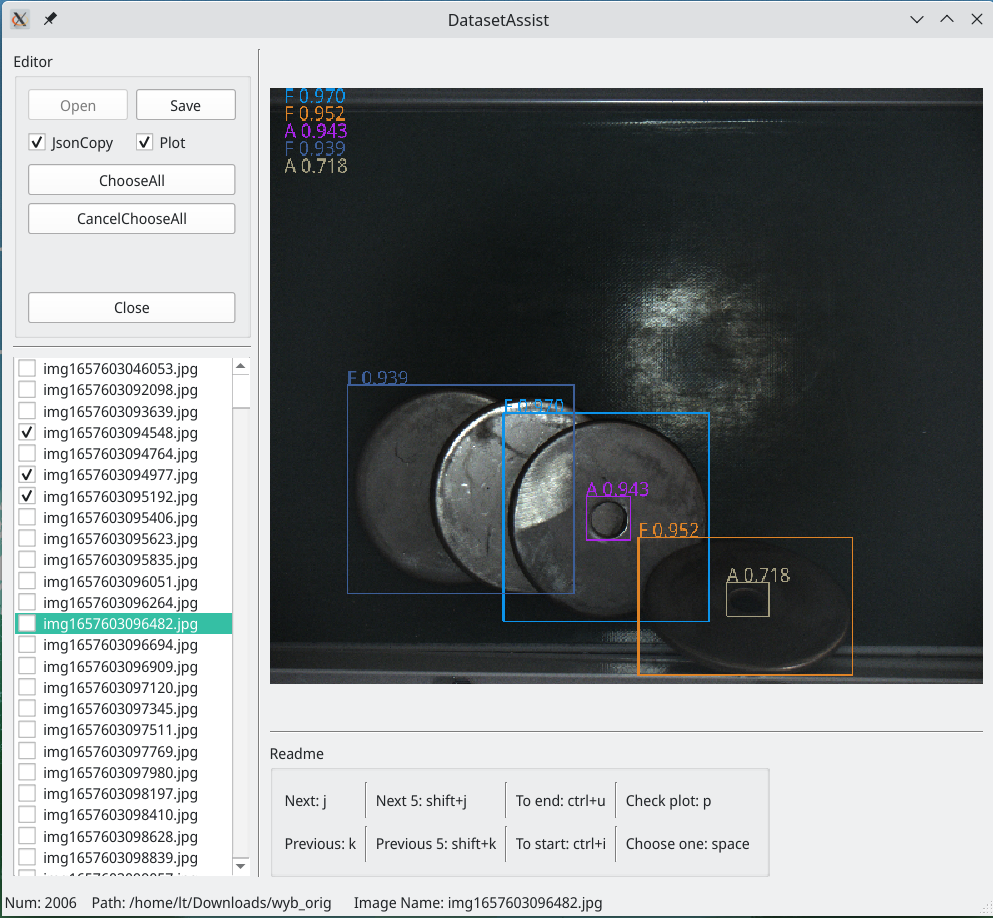

# DatasetAssist

# Requirements

- python3.8.5
- Pyside6

# Installation

- Download release package
- Run `./DatasetAssist`

# Key Features

- Batch Copy Images
- Show Images and Predict Result

# TODO

- Copy Progress
- Add Icon
- Translation